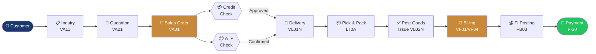
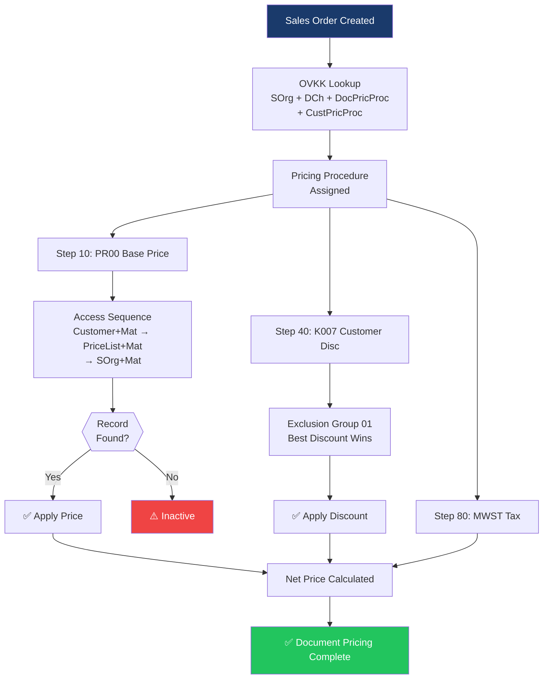
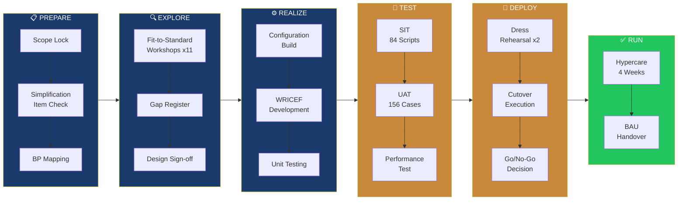

<!-- ANIMATED HEADER BANNER -->
<div align="center">
  
</div>

<!-- ANIMATED TYPING TEXT -->
<div align="center">
  
</div>

<br/>

<!-- BADGE ROW -->
<div align="center">

[](https://prashanth-sap-sd.github.io/prashanth-sap-sd/)
[](https://www.linkedin.com/in/pr-goud)
[](mailto:t.prashanth0728@gmail.com)
[](mailto:t.prashanth0728@gmail.com)
[](https://github.com/prashanth-sap-sd)

</div>

<br/>

---

## 🚀 About Me


```yaml
Name     : Prashanth Goud
Title    : Senior SAP SD / S/4HANA Consultant
Location : Pennsylvania, USA 🇺🇸
Experience: 10+ Years

Specialisation:
  - Order-to-Cash (OTC) End-to-End
  - Advanced Pricing & Condition Technique
  - S/4HANA Migration & Stabilisation
  - Billing, LE & FI Integration
  - EDI/IDoc & ALE Integration

Currently  : SAP SD Lead @ Experian
             ECC → S/4HANA Migration
Previous   : Molina Healthcare (OTC Lead)
             Global Atlantic Financial Group
             MTouchLabs · Jarus Technologies

Delivery   : 3 Full Lifecycle Implementations
             Zero P1 Defects at Go-Live
             Onsite + Offshore Team Leadership

Open For   : S/4HANA Migrations
             OTC Programme Delivery
             Pricing Architecture
             Production Support
```

<br clear="right"/>

---

## 🏆 GitHub Profile Trophies

<div align="center">

[](https://github.com/ryo-ma/github-profile-trophy)

</div>

---

## 🧠 SAP Skills & Technologies

<div align="center">

### Core SAP Platform
[](https://www.sap.com)
[](https://www.sap.com)
[](https://www.sap.com)
[](https://www.sap.com)
[](https://www.sap.com)

### OTC & SD Modules


### Integration


### Methodology & Tools


</div>

---

## 🏗️ Architecture & Workflow

### 🔄 End-to-End Order-to-Cash Flow



### 💰 Pricing Determination Architecture



### 🚀 S/4HANA Migration Workstream



---

## 📊 GitHub Analytics Dashboard

<div align="center">


</div>

---

## 🔥 Contribution Streak

<div align="center">

[](https://git.io/streak-stats)

</div>

---

## 📈 Contribution Activity Graph

<div align="center">

[](https://github.com/ashutosh00710/github-readme-activity-graph)

</div>

---

## 🌟 Featured Projects

<div align="center">

[](https://github.com/prashanth-sap-sd/sap-sd-portfolio)
[](https://github.com/prashanth-sap-sd/prashanth-sap-sd)

</div>

### 📂 Portfolio Highlights

| 🗂️ | Project | Description | Tags |
|---|---|---|---|
| 🏢 | **[Experian — S/4HANA Migration](./case-studies/case-study-1-experian-s4hana.md)** | ECC→S/4HANA · BRF+ · aATP · 42K BP records | `S/4HANA` `Migration` `Fiori` |
| 🏢 | **[Global Atlantic — Public Cloud OTC](./case-studies/case-study-2-global-atlantic.md)** | S/4HANA Public Cloud · SD-PS · Milestone Billing | `Cloud` `SSCUI` `Finance` |
| 🏢 | **[Molina Healthcare — OTC Lead](./case-studies/case-study-3-molina-healthcare.md)** | Full lifecycle · Agile · Offshore team · EDI | `OTC Lead` `Healthcare` `Agile` |
| 📋 | **[Cutover Planning Playbook](./playbooks/cutover-planning-playbook.md)** | 45-task runbook · Dress rehearsal · Go/No-Go | `Cutover` `Playbook` |
| ✅ | **[64-Point Go-Live Checklist](./checklists/go-live-readiness-checklist.md)** | Production readiness gate across 8 sections | `Checklist` `Quality` |
| 🔧 | **[Pricing Troubleshooting Guide](./reference-guides/pricing-troubleshooting-guide.md)** | 7-step diagnostic · All symptom patterns | `Pricing` `Reference` |
| 📖 | **[SD Transaction Reference](./reference-guides/sd-transaction-reference.md)** | Every SAP SD T-code categorised | `T-Codes` `Reference` |

---

## 🏆 Achievements & Highlights

<div align="center">

| 🎯 Achievement | 📊 Detail |
|---|---|
| 🏁 **Full Lifecycle Implementations** | 3 complete S/4HANA & ECC programmes |
| 🐛 **P1 Defects at Go-Live** | Zero — across all 3 programmes |
| ⏱️ **Cutover Execution** | 100% on-time within agreed windows |
| 📉 **Pricing Rationalisation** | 40%+ condition type reduction |
| 🧪 **UAT Sign-Off** | Consistent on-time business approval |
| 👥 **Team Leadership** | Onsite + offshore OTC team management |
| 🌐 **Industries Delivered** | Financial Services · Healthcare · InfoSvcs · Technology |
| 🔗 **EDI Standards** | X12 · EDIFACT · IDoc · ALE — all delivered |

</div>

---

## 📫 Connect With Me

<div align="center">

<a href="mailto:t.prashanth0728@gmail.com">
  
</a>

<a href="https://www.linkedin.com/in/pr-goud">
  
</a>

<a href="https://prashanth-sap-sd.github.io/prashanth-sap-sd/">
  
</a>

<br/><br/>

### 💬 Open to discussing:
`S/4HANA Migration` · `OTC Programme Delivery` · `Pricing Architecture` · `Production Support` · `Team Augmentation`

<br/>

*All case studies are sanitised to protect client confidentiality.*

</div>

<!-- ANIMATED FOOTER -->
<div align="center">
  
</div>
