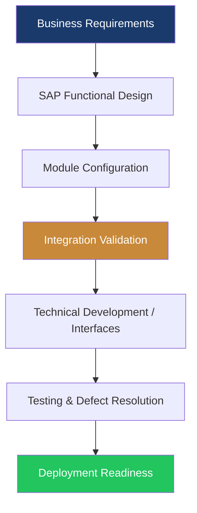

<!-- ANIMATED HEADER BANNER -->
<div align="center">
  
</div>

<!-- ANIMATED TYPING TEXT -->
<div align="center">
  
</div>

<br/>

<!-- BADGE ROW -->
<div align="center">

[](https://github.com/)
[](https://www.linkedin.com/in/prashanth-prashanth-57b691130)
[](mailto:prashanththotakuri30@gmail.com)
[](mailto:prashanththotakuri30@gmail.com)

</div>

<br/>

---

## 🚀 About Me


```yaml
Name       : Prashanth Thotakuri
Title      : Certified SAP S/4HANA Consultant
Experience : 10+ Years
Location   : United States

Expertise:
  - SAP S/4HANA & ECC
  - End-to-End Business Process Delivery
  - Cross-Module Integration
  - SAP Configuration & Solution Design
  - Implementations, Enhancements & Support
  - Data Migration, Testing & Cutover

Strengths:
  - Business Requirement Analysis
  - Functional Design Documentation
  - RICEFW Coordination
  - SIT / UAT / Hypercare Support
  - Stakeholder Collaboration
  - Offshore / Onsite Coordination
```

<br clear="right"/>

---

## 🧠 SAP Skills & Technologies

<div align="center">

### Core SAP Platform
[](https://www.sap.com)
[](https://www.sap.com)
[](https://www.sap.com)
[](https://www.sap.com)

### Functional & Delivery Areas


### Integration & Technical Awareness


### Methodology & Tools


</div>

---

## 🏗️ Delivery Framework

### 🔄 SAP Delivery Lifecycle


### 🔗 Cross-Module Collaboration



### 🚀 Implementation to Support Model


---

## 📌 Core Capabilities

- SAP ECC and S/4HANA solution delivery
- End-to-end business process analysis and optimization
- Cross-functional integration across enterprise SAP landscapes
- Configuration support aligned with business requirements
- Functional specifications and coordination with technical teams
- Data migration, validation, reconciliation, and cutover readiness
- Testing support including SIT, UAT, defect triage, and hypercare
- Production support, issue resolution, and continuous improvement

---

## 🌟 Featured Areas

| Area | Focus |
|---|---|
| **Implementations** | Full lifecycle SAP delivery from design to deployment |
| **Enhancements** | Business-driven improvements aligned to client needs |
| **Integration** | Coordination across modules, interfaces, and enterprise systems |
| **Support** | Post-go-live stabilization, issue analysis, and optimization |
| **Migration** | ECC to S/4HANA transition support, validation, and readiness |

---

## 🏆 Highlights

<div align="center">

| Achievement | Detail |
|---|---|
| **Experience** | 10+ years in SAP consulting and delivery |
| **Project Exposure** | Implementations, migrations, enhancements, and support |
| **Collaboration** | Business, functional, technical, and offshore coordination |
| **Delivery Focus** | Quality, stability, scalability, and process alignment |
| **System Knowledge** | SAP ECC, S/4HANA, integrations, testing, and cutover |

</div>

---

## 📫 Connect With Me

<div align="center">

<a href="mailto:prashanththotakuri30@gmail.com">
  
</a>

<a href="https://www.linkedin.com/in/prashanth-prashanth-57b691130">
  
</a>

<a href="https://github.com/">
  
</a>

<br/><br/>

### 💬 Open to discussing:
`SAP S/4HANA` · `ECC` · `Implementations` · `Enhancements` · `Support` · `Integration`

</div>

<!-- ANIMATED FOOTER -->
<div align="center">
  
</div>
