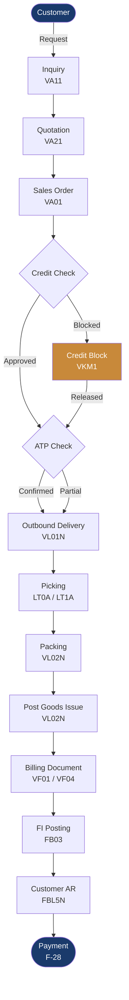
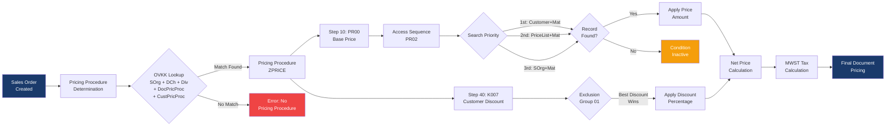
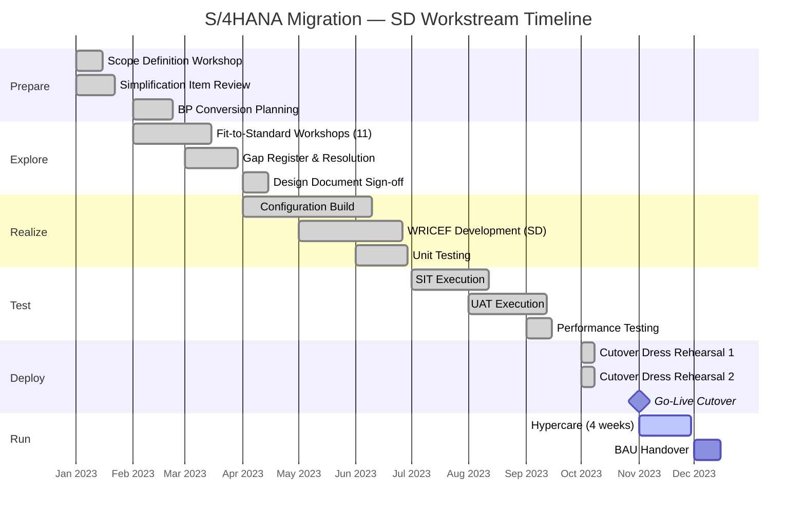
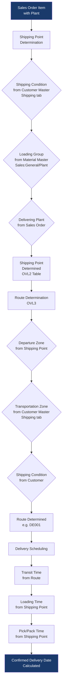
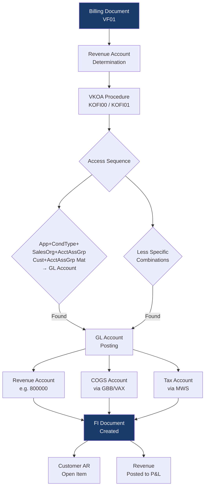
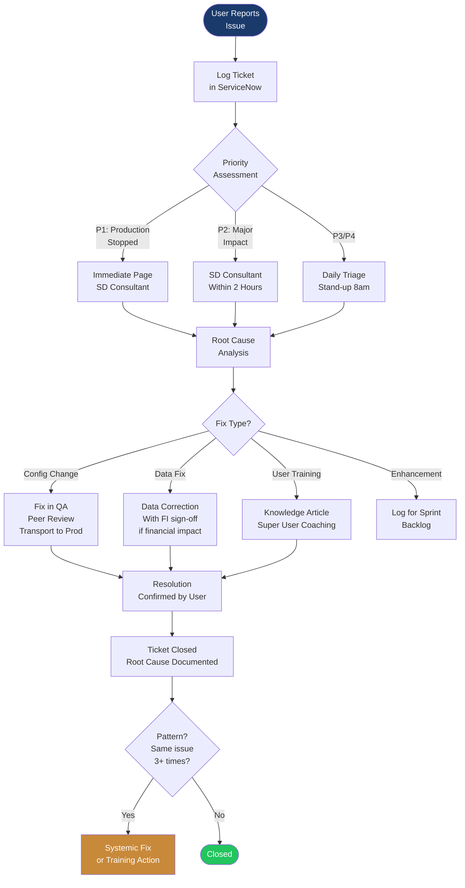

# Architecture Diagrams — SAP SD / S/4HANA

> Prashanth Goud — Senior SAP SD / S/4HANA Consultant  
> Process flow and architecture diagrams rendered via Mermaid

---

## Diagram 1: End-to-End OTC Process Flow

---

## Diagram 2: Condition Technique — Pricing Determination Flow

---

## Diagram 3: S/4HANA Migration — SD Workstream Phases

---

## Diagram 4: Shipping Point & Route Determination

---

## Diagram 5: SD–FI Account Determination Flow

---

## Diagram 6: Hypercare Incident Triage Flow

---

> *Diagrams rendered via GitHub Mermaid. If a diagram doesn't render in your viewer, the Mermaid source above can be pasted into [mermaid.live](https://mermaid.live) to view.*
